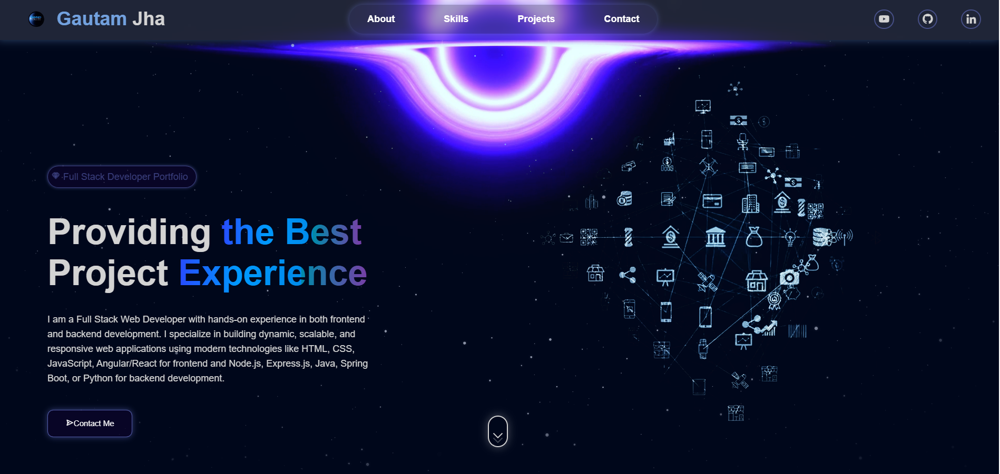

# 🌟 Animated Portfolio Website

An interactive and fully responsive animated personal portfolio website built using **HTML**, **CSS**, and **JavaScript**.

## 🔗 Live Demo

[Click here to view the live website](https://yourusername.github.io/animated-portfolio/)  
*(Replace this URL with your actual GitHub Pages or deployment link)*

---

## 📸 Preview

  
*(Add a screenshot of your website here)*

---

## ✨ Features

- Smooth scrolling and animated transitions
- Responsive design for all devices
- Animated hero section and skill bars
- Projects showcase section with hover effects
- Contact form with basic validation
- Light/Dark mode toggle *(optional)*
- Scroll-to-top button

---

## 🛠️ Built With

- **HTML5** – Structure
- **CSS3** – Styling and animations
- **JavaScript** – Interactivity and DOM manipulation

---

## 📁 Folder Structure

animated-portfolio/
├── index.html
├── style.css
├── script.js
├── assets/
│ ├── images/
│ └── icons/
└── README.md


---

## 🚀 Getting Started

1. Clone the repository:
   ```bash
   git clone https://github.com/Gautamjha321/animated-portfolio.git


cd animated-portfolio

start index.html  # On Windows
open index.html   # On macOS

✍️ Author
Gautam  Jha

GitHub

LinkedIn

Twitter (X)

📄 License
This project is licensed under the MIT License.

🙌 Contributing
Contributions are welcome! Please fork this repo and submit a pull request for any enhancements or fixes.

yaml
Copy
Edit

---

Would you like the full website source code to go with this `README.md`?